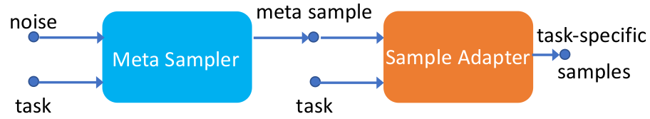
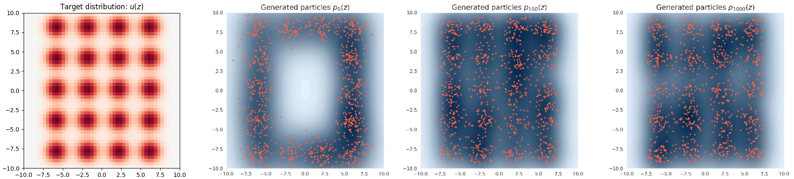

# Bayesian Meta Sampling

This repository contains source code for the papers of Bayesian Meta Sampling for Fast Uncertainty Adaptation (ICLR 2020)

## Introduction
In meta sampling, one is given a set of task-specific of related distributions, e.g., posterior distributions of the weights of a set
of Bayesian neural networks (BNNs), each of which is used for classification on a different but related dataset. 
 Each network and the related dataset is called a task. Our meta sampling framework consists of meta sampler and sample adapter.  Meta sampling aims to learn a meta sampler based on a set of training tasks so that samples from the meta sampler can be fast adapted to samples for an unseen new task by sample adapter. The sampler is composed of neural inverse-autoregressive flow (NIAF) and Wasserstein gradient flow (WGF), where the WGF is used for backpropagating the gradients into the parameters of NIAF to learn the meta sampler. 



 
## 2D Gaussian Mixture 
### 14-Gaussian to 20-Gaussian


A simple meta sampling example:
Using sample adapter to adapt the meta sampler from 14-Gaussian to 20-Gaussian
#### usage
```
python mixture2D.py
```

     

### Bayesian Logistic Regression


#### usage

With sample parameterization

For each dataset

```
python NIAF_BLR.py --dataset heart
```

```
python NIAF_BLR.py --dataset german
```

```
python NIAF_BLR.py --dataset australian
```

### Bayesian Meta Regression


#### usage

With sample parameterization

```
python meta_regression.py
```


### MNIST or CIFAR10 classification


#### usage

With multiplicative parametrization

```
python run_BNN.py
```


## Reference

If you are interested in our paper and useful for your research, please cite our paper with the following BibTex entry:

```
@inproceedings{Zhenyi_2020_ICLR,
  title={Bayesian Meta Sampling for Fast Uncertainty Adaptation},
  author={Zhenyi Wang, Yang Zhao, Ping Yu, Ruiyi Zhang, Changyou Chen},
  booktitle={ICLR},
  year={2020}
}
```


## Dependencies

Python -3.6 

pytorch -1.1.0

scikit-learn 0.22.1

scipy 1.3.1

The torchkit is used from [https://github.com/CW-Huang/torchkit](https://github.com/CW-Huang/torchkit) and is adapted to Python 3 


###To Do:

More code will be added later.


## Question ?
Please send me an email zhenyiwa@buffalo.edu if you have any question.


